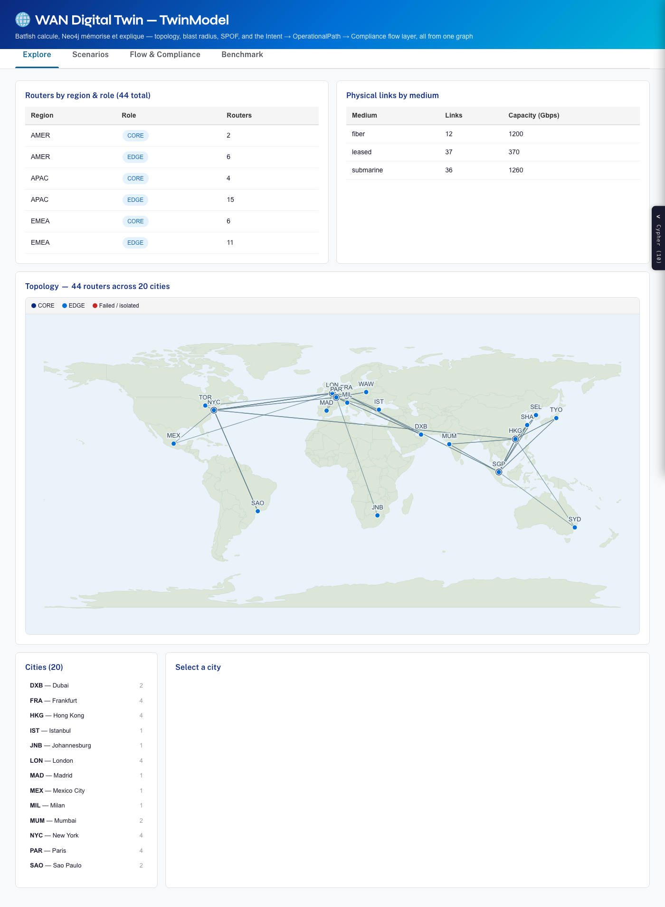
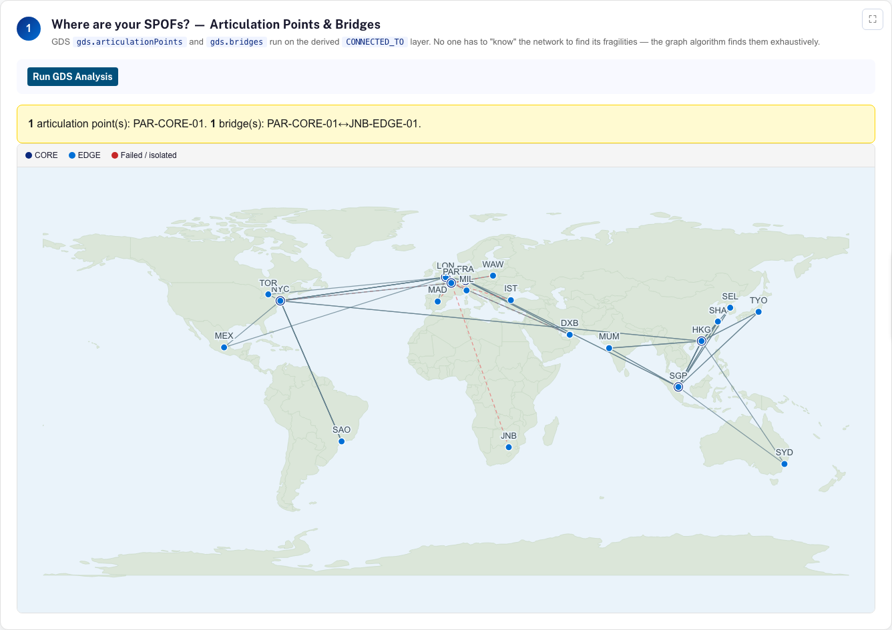
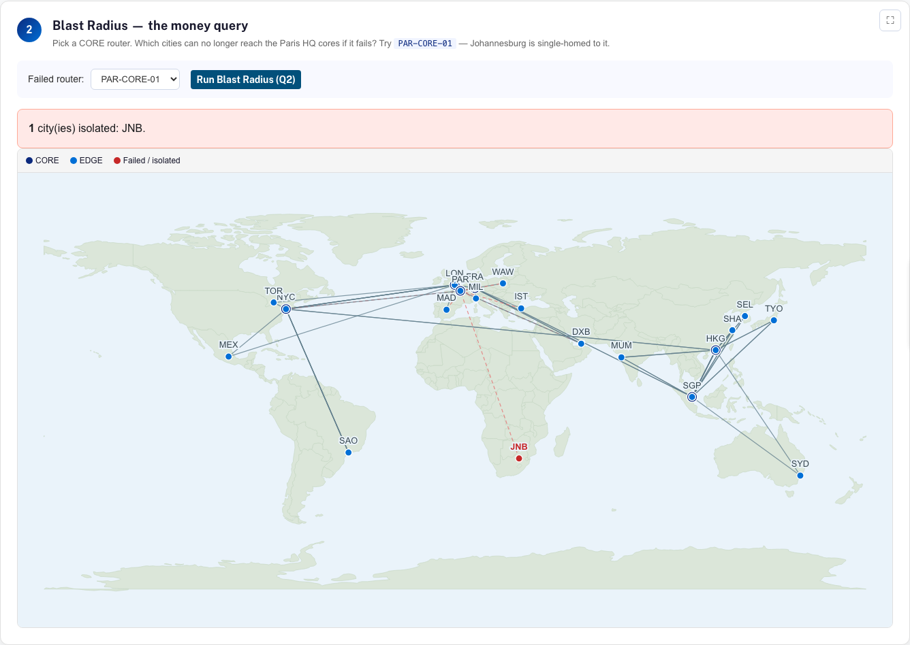
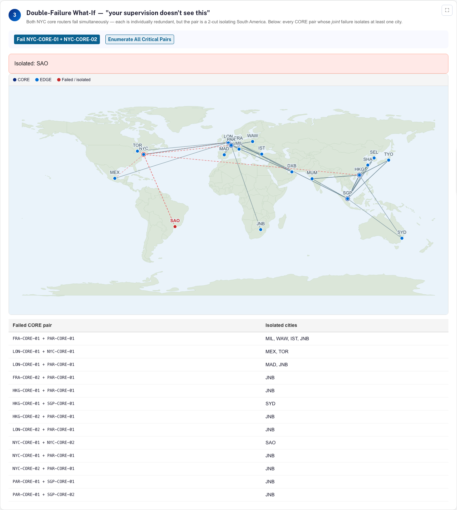
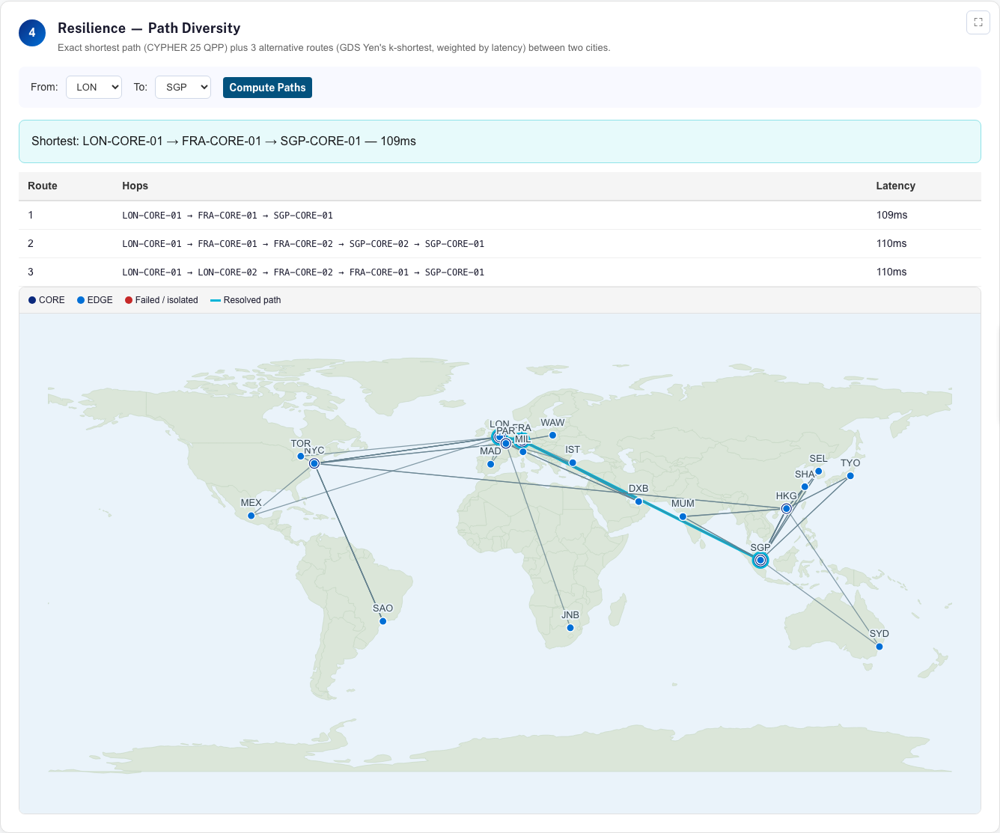
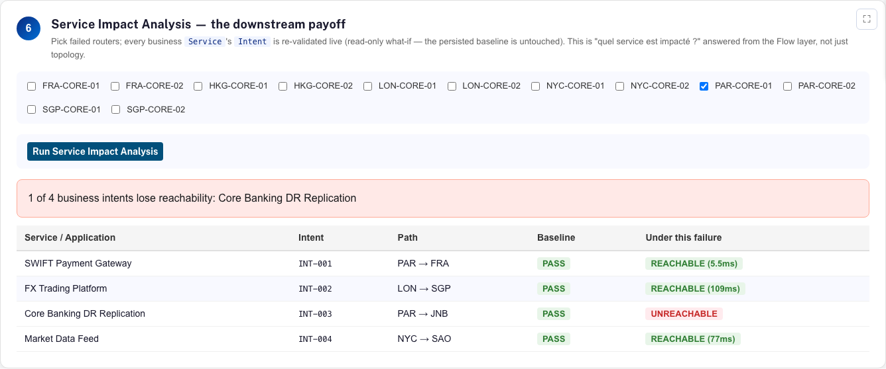
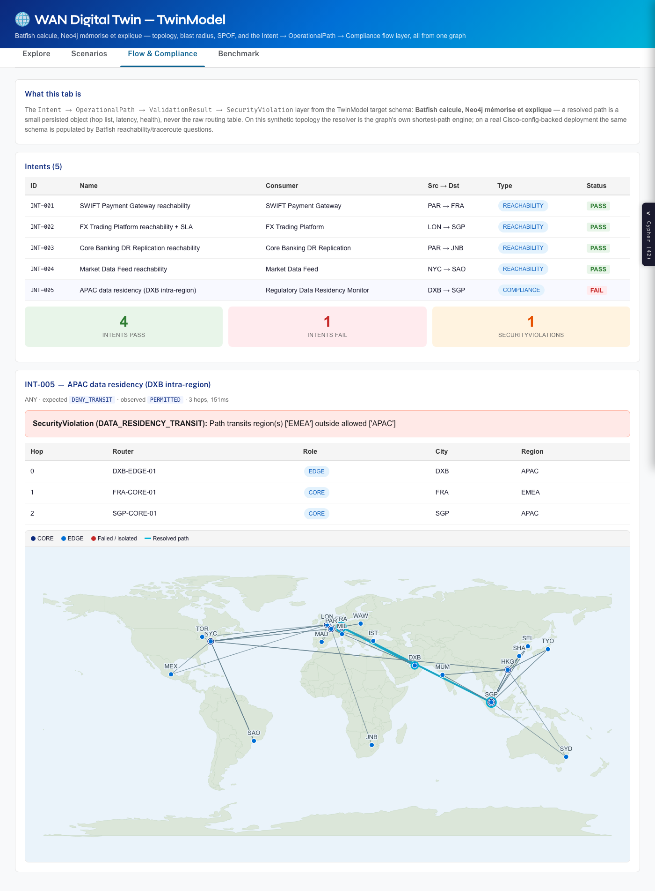
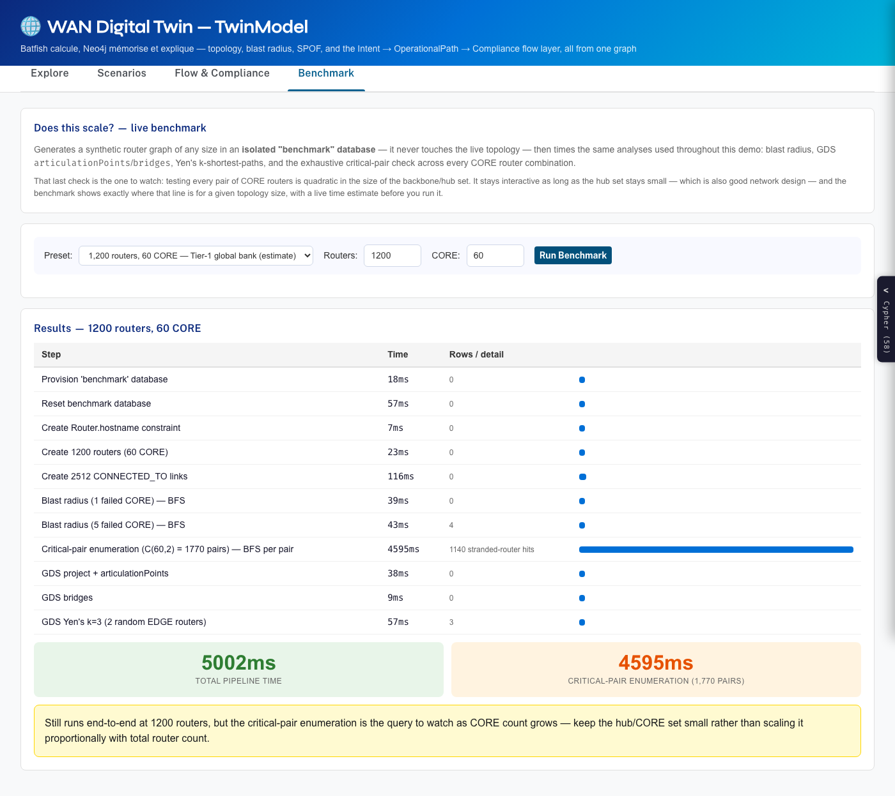
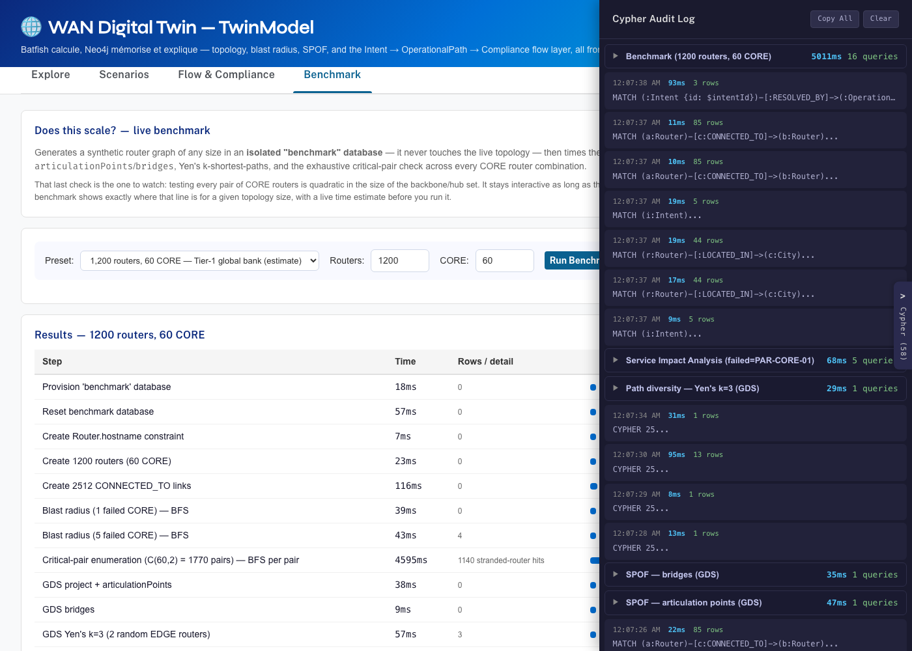

# WAN Digital Twin — Neo4j Network Digital Twin demo

A self-contained, reproducible demo: an international bank WAN (20 cities,
44 routers) modeled as a Neo4j graph, with blast-radius analysis, SPOF
detection (GDS articulation points / bridges), double-failure what-ifs, path
diversity, incident RCA, and a Leaflet impact map.

Scope: **topology reachability and impact analysis only**. No BGP route
selection, policy, or convergence simulation (that is Batfish's job — see the
optional Phase 2, which feeds Batfish output *into* this same graph schema).



## Requirements

- Docker (for Neo4j Enterprise + GDS + APOC), or any reachable Neo4j 5.26+/2025.x
  Enterprise instance with the GDS and APOC plugins
- Python 3.10+

## Run from scratch (< 5 minutes)

```bash
cp .env.example .env            # set NEO4J_PASSWORD
docker compose up -d neo4j      # wait ~30s for Neo4j to be available on :7474
pip install -r requirements.txt
python generate_topology.py     # writes data/*.csv (deterministic, seed=42)
python load.py                  # constraints -> CSVs -> derived layer (wipes the DB first)
python verify.py                # hard assertions V1-V7, exit 1 on failure
python export_impact.py --failed PAR-CORE-01
cd map && python -m http.server 8000
# open http://localhost:8000 -> Johannesburg in red
```

The exporter also writes `map/impact.geojson.js`, so opening `map/index.html`
directly (double-click, no HTTP server) works too — browsers block `fetch()`
on `file://`, and the page falls back to the JS twin in that case.

Check GDS is available before the demo: `RETURN gds.version()` in Browser
(http://localhost:7474). If the `neo4j:2025.05-enterprise` image fails to load
the GDS plugin, fall back to `neo4j:5.26-enterprise` in `docker-compose.yml`.
Developed and verified against Neo4j 2026.05 Enterprise / GDS 2026.05.

`load.py` **wipes the target database** before loading, so every run starts
from a clean state.

## Demo queries

All six queries in `cypher/demo/` run copy-paste from Neo4j Browser:

| File | What it shows | Parameters |
|---|---|---|
| `Q1_topology_overview.cypher` | inventory by region/role, link capacity, schema | — |
| `Q2_blast_radius.cypher` | cities cut off from Paris HQ | `:param failed => ['PAR-CORE-01']` → JNB |
| `Q3_spof_articulation.cypher` | articulation points + bridges (GDS) | — |
| `Q4_double_failure_whatif.cypher` | double failure + all critical CORE pairs | `:param failed => ['NYC-CORE-01','NYC-CORE-02']` → SAO |
| `Q5_resilience_paths.cypher` | shortest path + Yen's k=3 alternatives | `:param src => 'LON'` `:param dst => 'SGP'` |
| `Q6_incident_rca.cypher` | P1 incident overlay + impact + subgraph | — (creates INC-2026-0001; reset block at end of file) |

The demo narration (French) is in `DEMO_SCRIPT.md`.

## Interactive UI (`ui/`) — TwinModel Flow layer + live scenarios

A React app (same stack and look-and-feel as
[neo4j-flight-claim-demo](https://github.com/halftermeyer/neo4j-flight-claim-demo):
Vite + TypeScript + `@neo4j-ndl/react` + `neo4j-driver`, bolt straight from the
browser, hand-rolled deterministic SVG graphs, a global Cypher audit drawer)
against the **`wan`** database — a separate database from the default `neo4j`
(so it never collides with whatever else lives there) and from `batfish`
(Phase 2).

**Three tabs:**
- **Explore** — routers/cities/links, click through to a router's
  `CONNECTED_TO` neighbors and BGP sessions, full topology map (routers
  plotted by real lat/lon over a world land-mass backdrop, no force layout —
  deterministic, always readable). The backdrop is a small (~250KB) world
  outline bundled as a static asset and fetched same-origin — no live map
  tiles, no runtime internet dependency.
- **Scenarios** — six live acts reproducing `DEMO_SCRIPT.md`: SPOF discovery
  (GDS), blast radius (Q2), double-failure what-if + all 13 critical CORE
  pairs (Q4), path diversity / Yen's k=3 (Q5), incident RCA (Q6, writes to the
  graph), and **Service Impact Analysis** — the Flow-layer payoff: pick
  failed routers, every business `Service`'s `Intent` is re-validated live.
- **Flow & Compliance** — browse the `Intent → OperationalPath →
  ValidationResult → SecurityViolation` layer (see below), click an intent to
  see its resolved path on the map.
- **Benchmark** — live scaling test. Generates a synthetic router graph of any
  size (presets up to 5000, including a "1,200 routers, 60 CORE — Tier-1
  global bank" preset — an illustrative order-of-magnitude estimate, not any
  real bank's actual figures) in an **isolated `benchmark` database** (never touches
  `wan`), then times blast radius, the `O(n_core²)` critical-pair enumeration,
  and GDS `articulationPoints`/`bridges`/Yen's. The customer-facing intro
  copy in the tab itself is deliberately short; the engineering detail below
  is for this README. Three real scaling bugs were found and fixed while
  building this, worth knowing about if this topology ever grows a denser
  backbone:
  1. Reachability uses a single BFS (`apoc.path.subgraphNodes`) per check, not
     this demo's spec-prescribed per-router `EXISTS { variable-length
     MATCH }` — that pattern matches on *trails*, and proving a router
     unreachable in a graph with independent cycles (a meshed backbone, unlike
     this demo's sparse hub-and-spoke one) can force it to enumerate
     combinatorially many trails first. An early version of this tab hung on
     exactly that pattern at 400 routers with a denser CORE mesh.
  2. The BFS fix still diffed two per-pair *collected hostname lists* with
     list `IN` — cheap once, but called 19,900 times (200 CORE → `C(200,2)`
     pairs) it exceeded Neo4j's `dbms.memory.transaction.total.max` and
     crashed the query outright at 5000 routers. Fixed by replacing both list
     diffs with streaming `count()`s (isolated = total EDGE − reachable EDGE)
     — no hostname list is ever materialized.

  The remaining cost (`O(n_core² × graph size)`) is real algorithmic
  complexity, not a bug: the UI shows a live time estimate (calibrated from
  measured runs — ≈100s at 5000 routers/200 CORE) *before* you click, and
  every benchmark query carries a server-side timeout so a slow case fails
  cleanly and predictably instead of hanging the tab or crashing the
  database.

  A third bug, found from a report that queries failed "far before the 20s
  timeout" even at a modest 400 routers/108 CORE: `neo4j-driver`'s
  `TransactionConfig.timeout` is in **milliseconds**, not seconds — passing
  `{timeout: 20}` set an effective ~20ms timeout, not 20s. `lib/neo4j.ts`'s
  `runQuery(..., timeoutSeconds)` now converts (`timeoutSeconds * 1000`) so
  the human-friendly seconds-based parameter name at call sites is honored
  correctly. (Python's driver *is* seconds — `session.begin_transaction(timeout=20)`
  — which is what made this easy to miss testing from Python directly.)

Every result is backed by a visible Cypher statement in the audit drawer
(bottom-right tab), grouped by scenario — nothing is a black box.

## Screenshots

**The six live scenarios (Scenarios tab).** SPOF discovery finds the same
articulation point and bridge every time (deterministic topology); blast
radius and the double-failure what-if isolate exactly the cities the
topology was built to isolate; path diversity shows the resolved shortest
path highlighted on the map.

| SPOF discovery (GDS) | Blast radius — JNB isolated |
|---|---|
|  |  |
| **Double failure — SAO isolated + 13 critical pairs** | **Path diversity — LON→SGP, 3 alternatives** |
|  |  |

**Service Impact Analysis — the downstream payoff.** Fail `PAR-CORE-01` and
watch it live: three business services stay reachable, `Core Banking DR
Replication` doesn't — because it depends on Johannesburg's single point of
failure. This is "which service is impacted?" answered from the Flow layer,
not just topology.



**Flow & Compliance tab.** The `Intent → OperationalPath → ValidationResult →
SecurityViolation` layer: five intents, four passing, one real
`SecurityViolation` — traffic between Dubai and Singapore genuinely transits
an EMEA router, found by construction from the topology, not scripted.



**Does this scale? (Benchmark tab).** A live stress test against an isolated
database — never the demo's own data — with a Tier-1-bank-scale preset shown
here.



**Every result is auditable.** The Cypher statement behind any card is one
click away, grouped by scenario, with parameters and row counts.



### Setup

```bash
# 1. Build the Flow layer (once, after load.py has populated the wan db)
NEO4J_DATABASE=wan python load.py
NEO4J_DATABASE=wan python build_flow.py

# 2. Run the app
cd ui
cp .env.example .env    # edit with your credentials; VITE_NEO4J_DATABASE=wan
npm install
npm run dev             # http://localhost:5173
```

### The Flow layer (`build_flow.py`)

Implements the TwinModel target schema: `Application`/`Service -[:USES_INTENT]-> Intent
-[:SOURCE/DESTINATION]-> IntentGroup`, `Intent -[:RESOLVED_BY]->
OperationalPath -[:TRAVERSES]-> Router`, `Intent -[:VALIDATED_BY]->
ValidationResult`, `Intent -[:VIOLATED_BY]-> SecurityViolation`. Five intents,
grounded in facts actually computed from this topology (not invented):

| Intent | Path | Baseline | Why |
|---|---|---|---|
| SWIFT Payment Gateway | PAR→FRA | PASS | direct backbone, business-critical |
| FX Trading Platform | LON→SGP | PASS | SLA-bound (≤150ms), matches Q5 |
| Core Banking DR Replication | PAR→JNB | PASS | breaks if `PAR-CORE-01` fails (JNB's only SPOF) |
| Market Data Feed | NYC→SAO | PASS | breaks if the NYC core pair fails (the 2-cut) |
| APAC data residency (DXB) | DXB→SGP | **FAIL** | DXB's nearest 2 hubs are both EMEA (FRA, PAR) — genuinely transits outside APAC; real `SecurityViolation`, found by construction, not scripted |

**Path resolution here is done by the graph's own shortest-path/GDS engine**,
not Batfish — this synthetic topology has no real device configs. On a real,
real-config-backed deployment (see Phase 2 below) the same schema is
populated by Batfish `reachability`/`traceroute` questions instead; "Batfish
calcule, Neo4j mémorise et explique" holds either way, only the resolver
differs. `build_flow.py` is idempotent (`MERGE` throughout, safe to re-run).

## Neo4j Desktop 2 dashboard

`dashboard/wan_dashboard.json` is a 4-page dashboard (NeoDash 2.4 format, which
Desktop 2 imports natively): *Vue d'ensemble* (inventory, backbone graph),
*Blast radius* (failed-router selector driving the Q2 what-if, plus the
critical CORE-pair table), *SPOF & chemins* (GDS articulation points/bridges,
shortest path and Yen's k=3 between two selectable cities), *Incidents (RCA)*.

To use: Neo4j Desktop 2 → **Tools → Dashboards** → connect to the instance →
import the JSON file. Filters (failed router, source/destination city) are
dashboard parameters — change them and all linked cards refresh. The GDS cards
re-project small named graphs (`wan_dash_*`) on every refresh, so they always
reflect current data. Incident cards are empty until you run step 1 of
`Q6_incident_rca.cypher`.

## Query tool bookmarks

`bookmarks/wan_query_bookmarks.csv` imports into Neo4j Desktop 2's Query tool
(bookmarks import): one folder per demo step (Q1-Q6), 17 bookmarks total.
Param-setting bookmarks (`:param failed => ...`) come first in each folder that
needs them — run them before the step's query. GDS bookmarks are
self-contained (drop + re-project `wan_bm_*` graphs in a single statement).

`load.py` accepts an optional `NEO4J_DATABASE` env var (default `neo4j`) to
load the demo into a non-default database, e.g.
`NEO4J_DATABASE=wan python load.py` after `CREATE DATABASE wan` — useful when
the default database hosts something else.

## Bloom / Explore perspective

`bloom/wan_perspective.json` is an importable perspective (Bloom 2.3 format)
reproducing the demo: styled categories (City blue, Router orange, Incident
red), 8 search phrases mirroring demo steps 1-6 (`backbone core`,
`blast radius de <routeur>`, `spof du reseau`, `ponts critiques`,
`double panne NYC`, `chemin de <ville> vers <ville>`, `incidents en cours`,
`site de <ville>`) and 6 scene actions on selected routers (simulate failure
blast radius, expand CONNECTED_TO neighborhood, show physical interfaces/links,
show BGP sessions, declare a P1 incident, restore).

To import: Bloom / Desktop 2 Explore -> Perspective gallery -> Import, then
select the JSON. Notes: the blast-radius phrases return nothing when no city
is isolated (that IS the answer); the two incident scene actions are write
queries (Bloom asks to allow update queries); GDS phrases re-project small
named graphs (`wan_bloom_*`) on each run.

## Design decisions (where the spec left room)

- **Router distribution** (spec mandates 44 routers, 12 CORE): 2 CORE in each
  hub city (PAR, LON, NYC, SGP, HKG, FRA); 2 EDGE in PAR, LON, NYC, SGP, TYO,
  FRA, SAO, MUM (fixed by spec) plus HKG, DXB, SHA, SEL (chosen to reach
  32 EDGE); 1 EDGE in the remaining 8 cities.
- **SAO 2-cut**: each SAO edge router is dual-homed to *both* NYC cores. This
  keeps every EDGE (except JNB-EDGE-01) at degree >= 2 while making
  {NYC-CORE-01, NYC-CORE-02} a 2-cut that isolates South America.
- **EDGE homing**: each edge router links to one core router in each of its two
  nearest core cities; the core index matches the edge index (EDGE-01 -> CORE-01,
  EDGE-02 -> CORE-02) for deterministic load-spreading.
- **Link medium** for EDGE uplinks: `submarine` if the great-circle distance
  exceeds 3000 km, else `leased`. Intra-city links are `fiber`.
- **`bgp_sessions.csv`** holds both session kinds: `type=iBGP` rows peer two
  routers, `type=eBGP` rows peer a CORE router with a Provider (by name).
- **Determinism**: the generator is purely deterministic; the only seeded
  randomness (seed=42) is the round-robin offset for eBGP provider assignment.

## Layout

```
ndt-demo/
├── README.md                  # this file
├── DEMO_SCRIPT.md             # French demo narration
├── docker-compose.yml         # neo4j (+ optional batfish for Phase 2)
├── .env.example                     # NEO4J_URI, NEO4J_USER, NEO4J_PASSWORD
├── requirements.txt / requirements-batfish.txt
├── generate_topology.py       # writes CSVs into data/ (seed=42)
├── load.py                    # loads CSVs, runs cypher/*.cypher in order
├── verify.py                  # assertions V1-V7 (+ critical-pair report)
├── export_impact.py           # writes map/impact.geojson for a scenario
├── build_flow.py              # Intent/OperationalPath/Validation Flow layer
├── ingest_batfish.py           # Phase 2 — Batfish configs -> Neo4j (db "batfish")
├── verify_batfish.py           # assertions V8-V11
├── data/                      # generated CSVs (gitignored, regenerated)
├── cypher/
│   ├── 01_constraints.cypher / 02_derived_layer.cypher / 03_flow_constraints.cypher
│   └── demo/Q1..Q6
├── batfish_snapshot/configs/  # vendored example router configs (Phase 2)
├── map/                       # static Leaflet impact map
├── dashboard/                 # Neo4j Desktop 2 dashboard (NeoDash format)
├── bloom/                     # Bloom perspective (search phrases + scene actions)
├── bookmarks/                 # Neo4j Desktop 2 Query tool bookmarks
├── docs/screenshots/          # README screenshots
└── ui/                        # React app — Explore / Scenarios / Flow / Benchmark
    ├── src/{lib,components}/
    └── .env.example            # VITE_NEO4J_URI, _DATABASE, _USER, _PASSWORD
```

## Phase 2 (optional) — Batfish ingestion

Feeds Batfish-parsed real router configs into the **same graph schema**, in a
separate Neo4j database `batfish` (the synthetic demo database is never touched).

```bash
docker compose up -d batfish    # wait ~60s for Batfish to initialize
pip install -r requirements-batfish.txt
python ingest_batfish.py        # parses batfish_snapshot/, loads DB 'batfish'
python verify_batfish.py        # assertions V8-V11
```

The snapshot in `batfish_snapshot/configs/` is vendored from the Batfish
example network
(`github.com/batfish/batfish` → `networks/example/live/configs`), so runtime
is fully offline. In Browser, switch to database `batfish` (`:use batfish`)
and re-run Q1/Q3 unchanged.

Note: on Apple Silicon the `batfish/allinone` image runs under amd64
emulation (Docker prints a platform warning) — it works, just slower to start.
Batfish parses 13 example configs into 13 routers, 34 interfaces and 17
deduplicated links; the example network is well-meshed, so Q3 legitimately
returns zero articulation points there.
